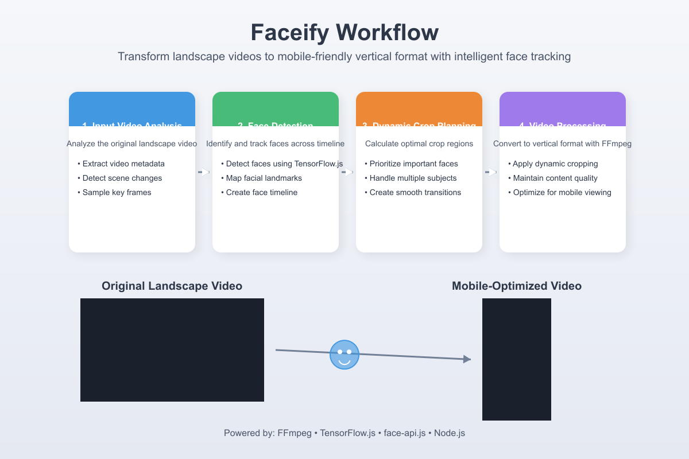

# Faceify 🎬

[](https://www.npmjs.com/package/@devansh-m12/faceify)
[](https://opensource.org/licenses/MIT)
[](https://www.npmjs.com/package/@devansh-m12/faceify)

<div align="center">
  
  <p><em>Transform landscape videos to mobile-friendly vertical format with intelligent face tracking</em></p>
</div>

## 🎥 Demo

<div align="center">
  <table>
    <tr>
      <td align="center"><strong>Before</strong></td>
      <td align="center"><strong>After</strong></td>
    </tr>
    <tr>
      <td>
        <a href="./public/before.mp4">
          
          <br>View Video
        </a>
      </td>
      <td>
        <a href="./public/after.mp4">
          
          <br>View Video
        </a>
      </td>
    </tr>
  </table>
</div>

## ✨ Features

- 📱 Convert landscape videos to mobile-friendly 9:16 vertical format
- 👁️ Intelligent face detection and tracking
- 🎯 Dynamic cropping that follows faces and important content
- 🔄 High-quality video processing using FFmpeg
- 📐 Customizable output dimensions
- 📝 TypeScript support

## 🚀 Installation

### Prerequisites

Before installing Faceify, ensure you have the following:

<details>
<summary><strong>1. Node.js</strong> (version 14 or higher)</summary>
<br>
Download from <a href="https://nodejs.org">nodejs.org</a>
</details>

<details>
<summary><strong>2. FFmpeg</strong> installed on your system</summary>
<br>
<ul>
  <li><strong>macOS</strong>: <code>brew install ffmpeg</code></li>
  <li><strong>Ubuntu/Debian</strong>: <code>sudo apt-get install ffmpeg</code></li>
  <li><strong>Windows</strong>: Download from <a href="https://ffmpeg.org/download.html">FFmpeg.org</a> and add to PATH</li>
</ul>
</details>

<details>
<summary><strong>3. Build tools</strong></summary>
<br>
<ul>
  <li><strong>macOS</strong>: <code>xcode-select --install</code></li>
  <li><strong>Ubuntu/Debian</strong>: <code>sudo apt-get install build-essential libcairo2-dev libpango1.0-dev libjpeg-dev libgif-dev librsvg2-dev</code></li>
  <li><strong>Windows</strong>: Install Visual Studio Build Tools with C++ workload</li>
</ul>
</details>

### Install Package

```bash
# Using npm
npm install @devansh-m12/faceify

# Using yarn
yarn add @devansh-m12/faceify

# Using pnpm
pnpm add @devansh-m12/faceify
```

## 📖 Usage

### Basic Example

```typescript
import { MobileVideoConverter } from '@devansh-m12/faceify';

async function convertVideo() {
  try {
    // Create converter instance
    const converter = new MobileVideoConverter({
      outputDirectory: './converted-videos',
      detectFaces: true
    });

    // Convert a video
    const result = await converter.convertVideo('path/to/your/video.mp4');

    console.log('Original Video:', result.originalPath);
    console.log('Converted Video:', result.convertedPath);
    
    // Access detected faces information
    if (result.faces && result.faces.length > 0) {
      console.log('Detected Faces:', result.faces);
    }
  } catch (error) {
    console.error('Video conversion failed:', error);
  }
}

convertVideo();
```

## 🛠️ API Reference

### `MobileVideoConverter`

The main class for converting videos.

#### Constructor

```typescript
new MobileVideoConverter(options?: VideoConverterOptions)
```

#### `VideoConverterOptions`

| Option | Type | Default | Description |
|--------|------|---------|-------------|
| `outputDirectory` | string | `'./converted-videos'` | Directory where converted videos will be saved |
| `targetWidth` | number | `1080` | Target width of the converted video |
| `targetHeight` | number | `1920` | Target height of the converted video |
| `detectFaces` | boolean | `true` | Enable/disable face detection |

#### Methods

##### `convertVideo(inputPath: string): Promise<ConversionResult>`

Converts a video to mobile-friendly vertical format.

- **inputPath**: Path to the video file to convert
- **Returns**: Promise that resolves to a ConversionResult object

##### `ConversionResult`

| Property | Type | Description |
|----------|------|-------------|
| `originalPath` | string | Path to the original video file |
| `convertedPath` | string | Path to the converted video file |
| `faces` | Array<{x: number, y: number, width: number, height: number}> | Information about detected faces |

## 🧠 How It Works

<div align="center">
  
</div>

Faceify uses advanced computer vision and video processing techniques:

1. **Face Detection**: Uses TensorFlow.js and face-api.js to detect and track faces throughout the video
2. **Scene Analysis**: Identifies important scene changes to create optimal crop points
3. **Dynamic Cropping**: Creates a smooth cropping timeline that follows faces and important content
4. **Video Processing**: Uses FFmpeg to create high-quality output videos with proper aspect ratio

## 🔍 Unique Face Recognition Technology

### Advanced Face Detection and Tracking

Faceify stands apart with its sophisticated face recognition algorithm that:

- **Multi-Face Recognition**: Intelligently identifies and tracks multiple faces simultaneously in complex scenes
- **Facial Landmark Detection**: Maps 68 distinct points on each face to analyze orientation, emotion, and prominence
- **Smart Priority System**: Automatically prioritizes primary speakers or subjects based on screen time and position
- **Temporal Consistency**: Maintains smooth transitions between scenes by analyzing facial movements across frames

### Intelligent Dynamic Cropping

Unlike basic center-crop solutions, Faceify's approach is truly adaptive:

- **Content-Aware Analysis**: Examines not just faces but also motion vectors and visual saliency
- **Predictive Tracking**: Anticipates face movements to position the frame optimally before they occur
- **Edge-Case Handling**: Gracefully manages challenging scenarios like rapid movements, multiple subjects, or subjects leaving frame
- **Aesthetic Composition**: Maintains proper headroom and leading space based on cinematography principles

### Technical Implementation

- **Real-time Processing Pipeline**: Optimized frame-by-frame analysis with minimal performance overhead
- **Configurable Sensitivity**: Fine-tune face detection confidence thresholds for your specific content
- **Hardware Acceleration**: Leverages GPU when available for faster processing on compatible systems
- **Fallback Logic**: Employs scene-based cropping when faces aren't detected, ensuring quality results in all scenarios

## 🔧 Advanced Usage

### Custom Dimensions

```typescript
const converter = new MobileVideoConverter({
  outputDirectory: './converted-videos',
  targetWidth: 720,    // Custom width
  targetHeight: 1280,  // Custom height
  detectFaces: true
});
```

### Disable Face Detection

```typescript
const converter = new MobileVideoConverter({
  outputDirectory: './converted-videos',
  detectFaces: false  // Disable face detection (uses center cropping)
});
```

## ❓ Troubleshooting

<details>
<summary><strong>Missing FFmpeg</strong></summary>
<br>
Ensure FFmpeg is properly installed and in your system PATH. Verify by running <code>ffmpeg -version</code> in your terminal.
</details>

<details>
<summary><strong>Build Errors</strong></summary>
<br>
Make sure you have the necessary build tools installed for your platform. Check the prerequisites section for details.
</details>

<details>
<summary><strong>Memory Issues</strong></summary>
<br>
For large videos, increase the Node.js memory limit: <code>node --max-old-space-size=4096 your-script.js</code>
</details>

## 🤝 Contributing

Contributions are welcome! Please feel free to submit a Pull Request.

1. Fork the repository
2. Create your feature branch (`git checkout -b feature/amazing-feature`)
3. Commit your changes (`git commit -m 'Add some amazing feature'`)
4. Push to the branch (`git push origin feature/amazing-feature`)
5. Open a Pull Request

## 📄 License

This project is licensed under the MIT License - see the [LICENSE](LICENSE) file for details.

---

<div align="center">
  <p>Made with ❤️ by <a href="https://github.com/devansh-m12">Devansh</a></p>
</div>
